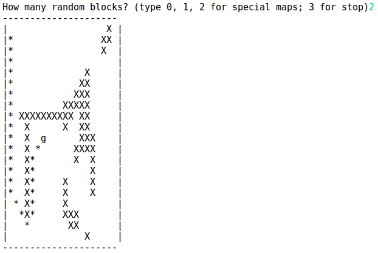

# Intro
In computer science, A* (pronounced as "A star") is a computer algorithm that is widely used in pathfinding and graph traversal, the process of plotting an efficiently directed path between multiple points, called nodes. It enjoys widespread use due to its performance and accuracy. However, in practical travel-routing systems, it is generally outperformed by algorithms which can pre-process the graph to attain better performance, although other work has found A* to be superior to other approaches.


# Feature
0. User gets prompt to choose custom map, the number of random blocks, and end. 
1. The node starts from the position (0, 0) and it looks for goal (g in the console). 
	X: obstacles
	g: goal (target)

2. User select the first custom map. The output returns the optimal for the user's selection


3. User select the second custom map


4. User select the third custom map


5. User select 10-random blocks. User can put any number


6. User select 200-random blocks.


7. User select 250-random blocks, but if the machine can't find optimal path because there are too many obstacles blocking our target, we suggest user to try again. 


8. User select 250-random blocks, and luckly it could find the path!


# Setup & Run
1. install java [Download Link](https://java.com/en/download/help/windows_manual_download.xml)

2. download whole files 

3. compile
```
javac *
```

4. run the main function
```
java runAStar
```


### Reference
A* search algorithm. (2017, March 12). In Wikipedia, The Free Encyclopedia. Retrieved 03:37, March 13, 2017, from https://en.wikipedia.org/w/index.php?title=A*_search_algorithm&oldid=769879955
